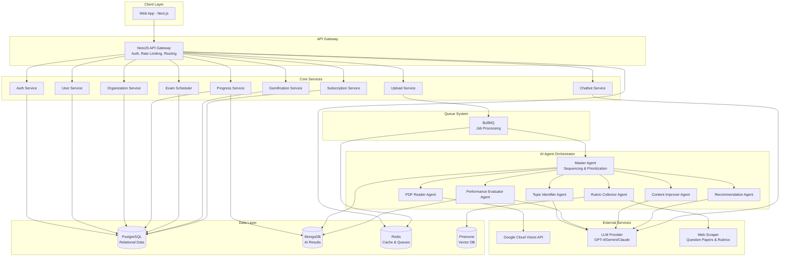
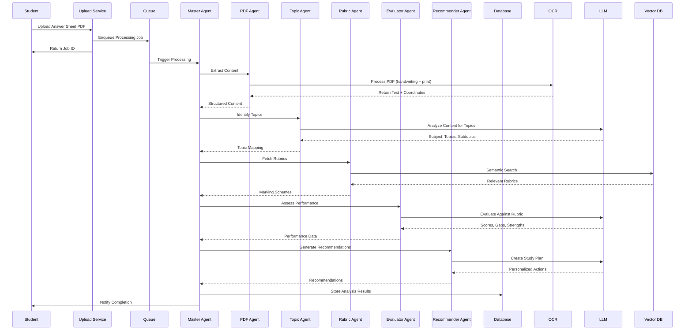

# StudAICoach - AI Student Assessment Platform
## Implementation Plan

---

## Executive Summary

**StudAICoach** is an AI-native **for-profit SaaS platform** that analyzes student answer sheets (MCQs and subjective responses), identifies topics, rates readiness, and tracks academic progress. The platform uses multi-agent AI orchestration to process PDF uploads (print + handwritten content), evaluate performance against board-specific rubrics, and provide personalized learning insights.

**Revenue Model**: Subscription-based SaaS with B2C launch (students) and B2B2C expansion (schools/colleges → students). Schools require paid plans only.

**Advanced Features**:
- Auto-correction of answer sheets using rubrics
- AI-powered question paper generation mimicking past paper patterns
- Manual OCR correction capability for quality assurance

**Core Value Propositions**:
- Automated answer sheet analysis with **trustworthy, high-accuracy OCR** (MCQs + subjective)
- **Auto-correction** of answer sheets using board-specific rubrics
- **AI-generated question papers** mimicking past paper patterns
- Topic-wise performance tracking and learning gap identification
- AI-powered study recommendations and tutoring with **extreme token optimization**
- Exam scheduling with intelligent revision prompts
- Gamification (badges, streaks, leaderboards)
- Progress reports for students, teachers, and parents
- On-demand question paper and rubric scraping
- **PII obfuscation** before AI processing for data privacy

---

## User Review Required

> [!IMPORTANT]
> **Multi-Tenancy Strategy**: We'll implement **row-level security (RLS)** with a shared database schema where each record has an `organizationId`. This allows seamless B2C → B2B2C transition without data migration.

> [!IMPORTANT]
> **OCR Trustworthiness**: OCR is the **most critical component** and must be trustworthy every time. We'll implement:
> - Primary: **Google Cloud Vision API** (highest accuracy for handwriting + print)
> - Fallback: **AWS Textract** for redundancy
> - **Manual OCR correction interface** for quality assurance
> - Confidence scoring with human-in-the-loop for low-confidence extractions
> - **PII obfuscation** (names, addresses, IDs) before sending to AI services

> [!WARNING]
> **Data Storage**: Only extracted data will be stored (not original PDFs). This reduces storage costs and ensures privacy. Re-analysis requires re-upload. **Confirmed acceptable**.

> [!IMPORTANT]
> **Revenue-Focused Subscription Model with AI Token Optimization**: 
> - **Free Tier (B2C only)**: 5 uploads/month, basic progress tracking, 20 chatbot queries/month
> - **Premium Individual**: Unlimited uploads, advanced analytics, 200 chatbot queries/month, exam scheduling, auto-correction
> - **Premium School (B2B - PAID ONLY)**: All premium features + bulk uploads, teacher dashboards, parent access, API integrations, unlimited tokens
> 
> **AI Token Cost Management**:
> - **Extreme token optimization**: Prompt compression, caching, response streaming
> - **Token pooling**: Shared token pools per organization for schools
> - **Cost allocation**: Track per-user token usage for billing transparency
> - **Smart routing**: Use cheaper models for simple tasks, premium models for complex analysis
> - **Batch processing**: Group similar requests to reduce API calls

---

## Technology Stack

### Frontend
- **Framework**: Next.js 14+ (App Router, TypeScript, React Server Components)
- **Styling**: TailwindCSS + shadcn/ui component library
- **State Management**: Zustand (global state) + React Query (server state)
- **Charts & Visualization**: Recharts + D3.js
- **PDF Preview**: react-pdf
- **Forms**: React Hook Form + Zod validation
- **Animations**: Framer Motion

### Backend
- **Framework**: NestJS (TypeScript, modular microservices architecture)
- **API**: RESTful + GraphQL (for complex queries)
- **Databases**: 
  - **MySQL 8.0+** (relational data - users, organizations, assessments, rubrics, AI results)
  - Redis (caching, session storage, queue management, token usage tracking)
- **ORM**: Prisma (MySQL) or TypeORM
- **Queue System**: BullMQ (async job processing)
- **File Storage**: Cloud storage (S3/GCS) - temporary upload staging only

### AI & ML Services
- **OCR**: 
  - Primary: **Google Cloud Vision API** (handwriting + print text)
  - Fallback: **AWS Textract**
  - **Manual correction interface** for quality assurance
  - **PII obfuscation layer** before AI processing
- **LLM**: Multi-provider support with **extreme token optimization**
  - OpenAI GPT-4 (complex analysis)
  - OpenAI GPT-4-mini (simple tasks - cost-effective)
  - Google Gemini (alternative provider)
  - Anthropic Claude (fallback)
- **Vector Database**: Pinecone (semantic search for rubrics, question papers)
- **Agent Orchestration**: Custom NestJS orchestrator with LangChain/LangGraph
- **Embeddings**: OpenAI text-embedding-3-small (cost-optimized)

### Infrastructure & DevOps
- **Containerization**: Docker + Docker Compose
- **CI/CD**: GitHub Actions with **extensive automated tests on each commit**
- **Monitoring**: Sentry (error tracking) + Prometheus + Grafana + AI token usage tracking
- **Logging**: Winston + ELK Stack (Elasticsearch, Logstash, Kibana)
- **Authentication**: 
  - JWT + OAuth2 (Google, Microsoft SSO)
  - **API Key authentication** for external integrations
  - **Webhook signature verification** for school system integrations
- **API Gateway**: NestJS with rate limiting (express-rate-limit)
- **Web Scraping**: Puppeteer (headless Chrome) for question papers and rubrics

---

## System Architecture

### High-Level Architecture



### Multi-Agent AI Pipeline



---

## Database Schema

### PostgreSQL Schema (Relational Data)

```prisma
// Multi-tenant base
model Organization {
  id            String   @id @default(uuid())
  name          String
  type          OrgType  // INDIVIDUAL, SCHOOL, COLLEGE
  tier          SubscriptionTier
  createdAt     DateTime @default(now())
  updatedAt     DateTime @updatedAt
  
  users         User[]
  students      Student[]
  subscriptions Subscription[]
}

enum OrgType {
  INDIVIDUAL
  SCHOOL
  COLLEGE
}

enum SubscriptionTier {
  FREE  // B2C only
  PREMIUM_INDIVIDUAL  // B2C
  PREMIUM_SCHOOL  // B2B - PAID ONLY (no free tier for schools)
}

// User Management
model User {
  id             String   @id @default(uuid())
  email          String   @unique
  passwordHash   String?
  name           String
  role           Role
  organizationId String
  organization   Organization @relation(fields: [organizationId], references: [id])
  createdAt      DateTime @default(now())
  updatedAt      DateTime @updatedAt
  
  studentProfile  Student?
  teacherProfile  Teacher?
  parentProfile   Parent?
}

enum Role {
  STUDENT
  TEACHER
  PARENT
  SCHOOL_ADMIN
  SUPER_ADMIN  // SaaS Platform Admin/Provider
}

// Academic Entities
model Student {
  id             String   @id @default(uuid())
  userId         String   @unique
  user           User     @relation(fields: [userId], references: [id])
  organizationId String
  organization   Organization @relation(fields: [organizationId], references: [id])
  grade          Int
  board          Board
  section        String?
  
  answerSheets   AnswerSheet[]
  progress       Progress[]
  examSchedules  ExamSchedule[]
  achievements   Achievement[]
  parentLinks    ParentStudent[]
}

enum Board {
  CBSE
  ICSE
  STATE_BOARD
  IB
  IGCSE
}

model Teacher {
  id             String   @id @default(uuid())
  userId         String   @unique
  user           User     @relation(fields: [userId], references: [id])
  subjects       Subject[]
}

model Parent {
  id             String   @id @default(uuid())
  userId         String   @unique
  user           User     @relation(fields: [userId], references: [id])
  children       ParentStudent[]
}

model ParentStudent {
  parentId   String
  parent     Parent  @relation(fields: [parentId], references: [id])
  studentId  String
  student    Student @relation(fields: [studentId], references: [id])
  
  @@id([parentId, studentId])
}

// Subject & Topic Hierarchy
model Subject {
  id          String   @id @default(uuid())
  name        String
  board       Board
  grade       Int
  topics      Topic[]
  rubrics     Rubric[]  // Store rubrics per subject
  
  @@unique([name, board, grade])
}

// Rubric Storage
model Rubric {
  id              String   @id @default(uuid())
  subjectId       String
  subject         Subject  @relation(fields: [subjectId], references: [id])
  board           Board
  grade           Int
  topicId         String?
  year            Int?     // Academic year
  title           String
  markingScheme   Json     // Detailed marking criteria
  totalMarks      Int
  sourceUrl       String?
  isVerified      Boolean  @default(false)
  createdAt       DateTime @default(now())
  updatedAt       DateTime @updatedAt
  
  @@index([subjectId, board, grade])
}

model Topic {
  id          String   @id @default(uuid())
  name        String
  subjectId   String
  subject     Subject  @relation(fields: [subjectId], references: [id])
  subtopics   Subtopic[]
  progress    Progress[]
}

model Subtopic {
  id          String   @id @default(uuid())
  name        String
  topicId     String
  topic       Topic    @relation(fields: [topicId], references: [id])
}

// Assessment & Progress
model AnswerSheet {
  id              String   @id @default(uuid())
  studentId       String
  student         Student  @relation(fields: [studentId], references: [id])
  subjectId       String
  assessmentType  AssessmentType
  questionType    QuestionType
  uploadedAt      DateTime @default(now())
  processingStatus ProcessingStatus
  analysisId      String?  // Reference to analysis results
  isCorrected     Boolean  @default(false)  // Auto-correction status
  totalMarks      Int?
  obtainedMarks   Float?
  
  ocrCorrections  OcrCorrection[]  // Manual OCR corrections
  
  @@index([studentId, uploadedAt])
}

enum QuestionType {
  MCQ
  SUBJECTIVE
  MIXED
}

// Manual OCR Correction Tracking
model OcrCorrection {
  id              String   @id @default(uuid())
  answerSheetId   String
  answerSheet     AnswerSheet @relation(fields: [answerSheetId], references: [id])
  pageNumber      Int
  blockIndex      Int
  originalText    String
  correctedText   String
  correctedBy     String   // userId
  correctedAt     DateTime @default(now())
  
  @@index([answerSheetId])
}

enum AssessmentType {
  FORMATIVE
  SUMMATIVE
  MOCK_TEST
  HOMEWORK
  PRACTICE
}

enum ProcessingStatus {
  PENDING
  PROCESSING
  COMPLETED
  FAILED
}

model Progress {
  id              String   @id @default(uuid())
  studentId       String
  student         Student  @relation(fields: [studentId], references: [id])
  topicId         String
  topic           Topic    @relation(fields: [topicId], references: [id])
  readinessScore  Float    // 0-100
  lastAssessed    DateTime
  trend           Trend
  
  @@unique([studentId, topicId])
}

enum Trend {
  IMPROVING
  STABLE
  DECLINING
}

// Exam Scheduling
model ExamSchedule {
  id          String   @id @default(uuid())
  studentId   String
  student     Student  @relation(fields: [studentId], references: [id])
  subjectId   String
  examName    String
  examDate    DateTime
  createdAt   DateTime @default(now())
  
  reminders   Reminder[]
}

model Reminder {
  id              String   @id @default(uuid())
  examScheduleId  String
  examSchedule    ExamSchedule @relation(fields: [examScheduleId], references: [id])
  reminderDate    DateTime
  type            ReminderType
  message         String
  sent            Boolean  @default(false)
}

enum ReminderType {
  REVISION_PROMPT
  REMEDIAL_ACTION
  STUDY_PLAN
}

// Gamification
model Achievement {
  id          String   @id @default(uuid())
  studentId   String
  student     Student  @relation(fields: [studentId], references: [id])
  badgeType   BadgeType
  earnedAt    DateTime @default(now())
  points      Int
}

enum BadgeType {
  FIRST_UPLOAD
  STREAK_7_DAYS
  STREAK_30_DAYS
  PERFECT_SCORE
  MOST_IMPROVED
  TOPIC_MASTER
}

model Leaderboard {
  id          String   @id @default(uuid())
  studentId   String
  scope       LeaderboardScope
  scopeId     String?  // classId, schoolId, null for global
  totalPoints Int
  rank        Int
  updatedAt   DateTime @updatedAt
  
  @@unique([studentId, scope, scopeId])
}

enum LeaderboardScope {
  CLASS
  SCHOOL
  GLOBAL
}

// Subscription Management
model Subscription {
  id              String   @id @default(uuid())
  organizationId  String
  organization    Organization @relation(fields: [organizationId], references: [id])
  tier            SubscriptionTier
  startDate       DateTime
  endDate         DateTime?
  status          SubscriptionStatus
  
  invoices        Invoice[]
}

enum SubscriptionStatus {
  ACTIVE
  CANCELLED
  EXPIRED
}

model Invoice {
  id              String   @id @default(uuid())
  subscriptionId  String
  subscription    Subscription @relation(fields: [subscriptionId], references: [id])
  amount          Float
  currency        String
  status          InvoiceStatus
  paidAt          DateTime?
  createdAt       DateTime @default(now())
}

enum InvoiceStatus {
  PENDING
  PAID
  FAILED
}

// AI Token Usage Tracking
model TokenUsage {
  id              String   @id @default(uuid())
  userId          String
  organizationId  String
  service         String   // 'ocr', 'chatbot', 'evaluation', 'generation'
  model           String   // 'gpt-4', 'gpt-4-mini', 'gemini', etc.
  promptTokens    Int
  completionTokens Int
  totalTokens     Int
  estimatedCost   Float
  timestamp       DateTime @default(now())
  
  @@index([userId, timestamp])
  @@index([organizationId, timestamp])
}

// Generated Question Papers
model GeneratedQuestionPaper {
  id              String   @id @default(uuid())
  subjectId       String
  board           Board
  grade           Int
  topicIds        Json     // Array of topic IDs
  pattern         String   // 'past_paper_mimic', 'custom'
  totalMarks      Int
  duration        Int      // in minutes
  questions       Json     // Array of generated questions
  generatedBy     String   // userId
  generatedAt     DateTime @default(now())
  downloadCount   Int      @default(0)
  
  @@index([subjectId, board, grade])
}
```

### MySQL Schema (AI Analysis Results)

> [!NOTE]
> All AI analysis results will be stored in MySQL as JSON columns for consistency and easier querying.

```sql
-- Answer Sheet Analysis (stored as JSON in MySQL)
CREATE TABLE answer_sheet_analysis (
  id VARCHAR(36) PRIMARY KEY,
  answer_sheet_id VARCHAR(36) NOT NULL,
  extracted_text JSON NOT NULL,  -- PII obfuscated
  identified_topics JSON NOT NULL,
  evaluation JSON NOT NULL,
  recommendations JSON NOT NULL,
  auto_correction JSON,  -- Auto-corrected answers with scores
  pii_obfuscated BOOLEAN DEFAULT TRUE,
  processed_at TIMESTAMP DEFAULT CURRENT_TIMESTAMP,
  processing_time_ms INT,
  FOREIGN KEY (answer_sheet_id) REFERENCES answer_sheet(id) ON DELETE CASCADE,
  INDEX idx_answer_sheet_id (answer_sheet_id)
);

-- Chat History
CREATE TABLE chat_conversation (
  id VARCHAR(36) PRIMARY KEY,
  user_id VARCHAR(36) NOT NULL,
  messages JSON NOT NULL,
  token_usage INT DEFAULT 0,
  created_at TIMESTAMP DEFAULT CURRENT_TIMESTAMP,
  updated_at TIMESTAMP DEFAULT CURRENT_TIMESTAMP ON UPDATE CURRENT_TIMESTAMP,
  FOREIGN KEY (user_id) REFERENCES user(id) ON DELETE CASCADE,
  INDEX idx_user_id (user_id)
);
```

**JSON Structure Examples**:

```typescript
// extracted_text JSON structure (PII obfuscated)
{
  pages: [{
    pageNumber: 1,
    blocks: [{
      text: "[STUDENT_NAME] solved the equation...",  // PII replaced
      confidence: 0.95,
      boundingBox: { x: 100, y: 200, width: 300, height: 50 },
      isHandwritten: true,
      manuallycorrected: false
    }]
  }]
}

// auto_correction JSON structure
{
  totalMarks: 100,
  obtainedMarks: 78,
  questionWiseScores: [{
    questionNumber: 1,
    maxMarks: 10,
    obtainedMarks: 8,
    rubricMatched: ["correct formula", "proper steps"],
    rubricMissed: ["unit missing"],
    feedback: "Good approach, remember to include units"
  }]
}
```

---

## API Structure

### Core API Endpoints

#### Authentication & User Management
```
POST   /api/auth/register
POST   /api/auth/login
POST   /api/auth/oauth/google
POST   /api/auth/oauth/microsoft
POST   /api/auth/refresh
POST   /api/auth/logout
GET    /api/users/me
PATCH  /api/users/me
```

#### Organization Management (B2B2C)
```
POST   /api/organizations
GET    /api/organizations/:id
PATCH  /api/organizations/:id
POST   /api/organizations/:id/students/bulk-import
GET    /api/organizations/:id/analytics
```

#### Answer Sheet Processing
```
POST   /api/answer-sheets/upload
GET    /api/answer-sheets/:id/status
GET    /api/answer-sheets/:id/analysis
GET    /api/answer-sheets/student/:studentId
DELETE /api/answer-sheets/:id
```

#### Progress & Analytics
```
GET    /api/progress/student/:studentId
GET    /api/progress/student/:studentId/subject/:subjectId
GET    /api/progress/student/:studentId/topic/:topicId
GET    /api/progress/student/:studentId/trends
GET    /api/progress/student/:studentId/report (PDF download)
```

#### Exam Scheduling
```
POST   /api/exams
GET    /api/exams/student/:studentId
PATCH  /api/exams/:id
DELETE /api/exams/:id
GET    /api/exams/:id/study-plan
```

#### Gamification
```
GET    /api/achievements/student/:studentId
GET    /api/leaderboard/:scope
GET    /api/leaderboard/:scope/:scopeId
```

#### Chatbot
```
POST   /api/chat/message
GET    /api/chat/conversations
GET    /api/chat/conversations/:id
DELETE /api/chat/conversations/:id
```

#### Question Papers & Rubrics
```
POST   /api/scraper/question-papers (on-demand)
POST   /api/scraper/rubrics (on-demand)
GET    /api/question-papers/search
GET    /api/rubrics/search
```

#### Integration APIs (for Schools - Strong Authentication Required)
```
# API Key + Signature-based authentication
POST   /api/integrations/webhook
GET    /api/integrations/students/sync
POST   /api/integrations/sso/configure
GET    /api/integrations/api-keys/generate
POST   /api/integrations/api-keys/rotate
```

#### Subscription Management
```
GET    /api/subscriptions/plans
POST   /api/subscriptions/subscribe
POST   /api/subscriptions/upgrade
POST   /api/subscriptions/cancel
GET    /api/subscriptions/invoices
GET    /api/subscriptions/token-usage
```

#### OCR Manual Correction
```
GET    /api/ocr/corrections/:answerSheetId
POST   /api/ocr/corrections/:answerSheetId
PATCH  /api/ocr/corrections/:correctionId
```

#### Question Paper Generation
```
POST   /api/question-papers/generate
GET    /api/question-papers/:id
GET    /api/question-papers/history
GET    /api/question-papers/:id/download
```

#### Super Admin (SaaS Provider)
```
GET    /api/admin/organizations
GET    /api/admin/analytics/revenue
GET    /api/admin/analytics/token-usage
GET    /api/admin/system-health
PATCH  /api/admin/feature-flags
GET    /api/admin/implementation-plan
PATCH  /api/admin/implementation-plan
GET    /api/admin/task-list
PATCH  /api/admin/task-list
```

---

## Proposed Changes

### Phase 1: MVP Foundation (Weeks 1-4)

#### Backend Core
- **[NEW]** [package.json](file:///c:/Users/t_cse/Documents/FunDev/StudAICoach/backend/package.json)
- **[NEW]** [docker-compose.yml](file:///c:/Users/t_cse/Documents/FunDev/StudAICoach/docker-compose.yml)
- **[NEW]** [prisma/schema.prisma](file:///c:/Users/t_cse/Documents/FunDev/StudAICoach/backend/prisma/schema.prisma)
- **[NEW]** [src/main.ts](file:///c:/Users/t_cse/Documents/FunDev/StudAICoach/backend/src/main.ts)
- **[NEW]** [src/app.module.ts](file:///c:/Users/t_cse/Documents/FunDev/StudAICoach/backend/src/app.module.ts)

#### Authentication Module
- **[NEW]** [src/auth/auth.module.ts](file:///c:/Users/t_cse/Documents/FunDev/StudAICoach/backend/src/auth/auth.module.ts)
- **[NEW]** [src/auth/auth.service.ts](file:///c:/Users/t_cse/Documents/FunDev/StudAICoach/backend/src/auth/auth.service.ts)
- **[NEW]** [src/auth/auth.controller.ts](file:///c:/Users/t_cse/Documents/FunDev/StudAICoach/backend/src/auth/auth.controller.ts)
- **[NEW]** [src/auth/strategies/jwt.strategy.ts](file:///c:/Users/t_cse/Documents/FunDev/StudAICoach/backend/src/auth/strategies/jwt.strategy.ts)
- **[NEW]** [src/auth/guards/roles.guard.ts](file:///c:/Users/t_cse/Documents/FunDev/StudAICoach/backend/src/auth/guards/roles.guard.ts)

#### Upload & OCR Module
- **[NEW]** [src/upload/upload.module.ts](file:///c:/Users/t_cse/Documents/FunDev/StudAICoach/backend/src/upload/upload.module.ts)
- **[NEW]** [src/upload/upload.service.ts](file:///c:/Users/t_cse/Documents/FunDev/StudAICoach/backend/src/upload/upload.service.ts)
- **[NEW]** [src/upload/upload.controller.ts](file:///c:/Users/t_cse/Documents/FunDev/StudAICoach/backend/src/upload/upload.controller.ts)
- **[NEW]** [src/ocr/ocr.service.ts](file:///c:/Users/t_cse/Documents/FunDev/StudAICoach/backend/src/ocr/ocr.service.ts)

#### AI Agent Orchestrator
- **[NEW]** [src/agents/orchestrator.service.ts](file:///c:/Users/t_cse/Documents/FunDev/StudAICoach/backend/src/agents/orchestrator.service.ts)
- **[NEW]** [src/agents/pdf-reader.agent.ts](file:///c:/Users/t_cse/Documents/FunDev/StudAICoach/backend/src/agents/pdf-reader.agent.ts)
- **[NEW]** [src/agents/topic-identifier.agent.ts](file:///c:/Users/t_cse/Documents/FunDev/StudAICoach/backend/src/agents/topic-identifier.agent.ts)
- **[NEW]** [src/agents/evaluator.agent.ts](file:///c:/Users/t_cse/Documents/FunDev/StudAICoach/backend/src/agents/evaluator.agent.ts)
- **[NEW]** [src/agents/auto-corrector.agent.ts](file:///c:/Users/t_cse/Documents/FunDev/StudAICoach/backend/src/agents/auto-corrector.agent.ts)
- **[NEW]** [src/agents/question-generator.agent.ts](file:///c:/Users/t_cse/Documents/FunDev/StudAICoach/backend/src/agents/question-generator.agent.ts)
- **[NEW]** [src/common/pii-obfuscator.service.ts](file:///c:/Users/t_cse/Documents/FunDev/StudAICoach/backend/src/common/pii-obfuscator.service.ts)
- **[NEW]** [src/common/token-optimizer.service.ts](file:///c:/Users/t_cse/Documents/FunDev/StudAICoach/backend/src/common/token-optimizer.service.ts)

---

### Phase 2: Frontend MVP (Weeks 5-6)

#### Core Setup
- **[NEW]** [frontend/package.json](file:///c:/Users/t_cse/Documents/FunDev/StudAICoach/frontend/package.json)
- **[NEW]** [frontend/tailwind.config.ts](file:///c:/Users/t_cse/Documents/FunDev/StudAICoach/frontend/tailwind.config.ts)
- **[NEW]** [frontend/src/app/layout.tsx](file:///c:/Users/t_cse/Documents/FunDev/StudAICoach/frontend/src/app/layout.tsx)

#### Authentication Pages
- **[NEW]** [frontend/src/app/(auth)/login/page.tsx](file:///c:/Users/t_cse/Documents/FunDev/StudAICoach/frontend/src/app/(auth)/login/page.tsx)
- **[NEW]** [frontend/src/app/(auth)/register/page.tsx](file:///c:/Users/t_cse/Documents/FunDev/StudAICoach/frontend/src/app/(auth)/register/page.tsx)

#### Dashboard
- **[NEW]** [frontend/src/app/(dashboard)/dashboard/page.tsx](file:///c:/Users/t_cse/Documents/FunDev/StudAICoach/frontend/src/app/(dashboard)/dashboard/page.tsx)
- **[NEW]** [frontend/src/components/upload/AnswerSheetUpload.tsx](file:///c:/Users/t_cse/Documents/FunDev/StudAICoach/frontend/src/components/upload/AnswerSheetUpload.tsx)
- **[NEW]** [frontend/src/components/progress/ProgressDashboard.tsx](file:///c:/Users/t_cse/Documents/FunDev/StudAICoach/frontend/src/components/progress/ProgressDashboard.tsx)

---

### Phase 3: Advanced Features (Weeks 7-10)

#### Exam Scheduling Module
- **[NEW]** [src/exam/exam.module.ts](file:///c:/Users/t_cse/Documents/FunDev/StudAICoach/backend/src/exam/exam.module.ts)
- **[NEW]** [src/exam/exam.service.ts](file:///c:/Users/t_cse/Documents/FunDev/StudAICoach/backend/src/exam/exam.service.ts)
- **[NEW]** [src/exam/reminder.service.ts](file:///c:/Users/t_cse/Documents/FunDev/StudAICoach/backend/src/exam/reminder.service.ts)

#### Gamification Module
- **[NEW]** [src/gamification/gamification.module.ts](file:///c:/Users/t_cse/Documents/FunDev/StudAICoach/backend/src/gamification/gamification.module.ts)
- **[NEW]** [src/gamification/achievement.service.ts](file:///c:/Users/t_cse/Documents/FunDev/StudAICoach/backend/src/gamification/achievement.service.ts)
- **[NEW]** [src/gamification/leaderboard.service.ts](file:///c:/Users/t_cse/Documents/FunDev/StudAICoach/backend/src/gamification/leaderboard.service.ts)

#### Chatbot Module
- **[NEW]** [src/chatbot/chatbot.module.ts](file:///c:/Users/t_cse/Documents/FunDev/StudAICoach/backend/src/chatbot/chatbot.module.ts)
- **[NEW]** [src/chatbot/chatbot.service.ts](file:///c:/Users/t_cse/Documents/FunDev/StudAICoach/backend/src/chatbot/chatbot.service.ts)
- **[NEW]** [frontend/src/components/chat/ChatInterface.tsx](file:///c:/Users/t_cse/Documents/FunDev/StudAICoach/frontend/src/components/chat/ChatInterface.tsx)

#### Web Scraper Module
- **[NEW]** [src/scraper/scraper.module.ts](file:///c:/Users/t_cse/Documents/FunDev/StudAICoach/backend/src/scraper/scraper.module.ts)
- **[NEW]** [src/scraper/question-paper.scraper.ts](file:///c:/Users/t_cse/Documents/FunDev/StudAICoach/backend/src/scraper/question-paper.scraper.ts)
- **[NEW]** [src/scraper/rubric.scraper.ts](file:///c:/Users/t_cse/Documents/FunDev/StudAICoach/backend/src/scraper/rubric.scraper.ts)

---

### Phase 4: B2B2C Features (Weeks 11-12)

#### Organization Management
- **[NEW]** [src/organization/organization.module.ts](file:///c:/Users/t_cse/Documents/FunDev/StudAICoach/backend/src/organization/organization.module.ts)
- **[NEW]** [src/organization/organization.service.ts](file:///c:/Users/t_cse/Documents/FunDev/StudAICoach/backend/src/organization/organization.service.ts)
- **[NEW]** [src/organization/bulk-import.service.ts](file:///c:/Users/t_cse/Documents/FunDev/StudAICoach/backend/src/organization/bulk-import.service.ts)

#### Teacher & Parent Dashboards
- **[NEW]** [frontend/src/app/(dashboard)/teacher/page.tsx](file:///c:/Users/t_cse/Documents/FunDev/StudAICoach/frontend/src/app/(dashboard)/teacher/page.tsx)
- **[NEW]** [frontend/src/app/(dashboard)/parent/page.tsx](file:///c:/Users/t_cse/Documents/FunDev/StudAICoach/frontend/src/app/(dashboard)/parent/page.tsx)

#### Integration APIs
- **[NEW]** [src/integrations/integrations.module.ts](file:///c:/Users/t_cse/Documents/FunDev/StudAICoach/backend/src/integrations/integrations.module.ts)
- **[NEW]** [src/integrations/webhook.controller.ts](file:///c:/Users/t_cse/Documents/FunDev/StudAICoach/backend/src/integrations/webhook.controller.ts)
- **[NEW]** [docs/integration-api.md](file:///c:/Users/t_cse/Documents/FunDev/StudAICoach/docs/integration-api.md)

---

### Phase 5: Subscription & Deployment (Weeks 13-14)

#### Subscription Module
- **[NEW]** [src/subscription/subscription.module.ts](file:///c:/Users/t_cse/Documents/FunDev/StudAICoach/backend/src/subscription/subscription.module.ts)
- **[NEW]** [src/subscription/subscription.service.ts](file:///c:/Users/t_cse/Documents/FunDev/StudAICoach/backend/src/subscription/subscription.service.ts)
- **[NEW]** [src/subscription/payment.service.ts](file:///c:/Users/t_cse/Documents/FunDev/StudAICoach/backend/src/subscription/payment.service.ts)

#### DevOps
- **[NEW]** [.github/workflows/ci-cd.yml](file:///c:/Users/t_cse/Documents/FunDev/StudAICoach/.github/workflows/ci-cd.yml)
- **[NEW]** [Dockerfile.backend](file:///c:/Users/t_cse/Documents/FunDev/StudAICoach/backend/Dockerfile)
- **[NEW]** [Dockerfile.frontend](file:///c:/Users/t_cse/Documents/FunDev/StudAICoach/frontend/Dockerfile)
- **[NEW]** [kubernetes/deployment.yml](file:///c:/Users/t_cse/Documents/FunDev/StudAICoach/kubernetes/deployment.yml)

---

## Verification Plan

### Automated Tests

#### Backend Tests (Run on Each Commit)
```bash
# Unit tests for services
yarn test

# Integration tests for APIs
yarn test:e2e

# OCR accuracy test with sample answer sheets (MCQ + subjective)
yarn test:ocr

# Agent orchestration test
yarn test:agents

# PII obfuscation test
yarn test:pii

# Token optimization test
yarn test:tokens

# Auto-correction accuracy test
yarn test:correction

# Question generation test
yarn test:generation

# API authentication & security test
yarn test:security
```

#### Frontend Tests
```bash
# Component tests
yarn test

# E2E tests with Playwright
yarn test:e2e
```

### Manual Verification

#### Core Workflow Test
1. Register as a student user
2. Upload a sample answer sheet (PDF with handwriting + print)
3. Verify OCR extraction accuracy
4. Confirm topic identification is correct
5. Check performance evaluation scores
6. Review personalized recommendations
7. Verify progress dashboard updates

#### Multi-Tenancy Test
1. Create a school organization
2. Bulk import students
3. Verify data isolation between organizations
4. Test teacher dashboard access
5. Test parent access to child's data

#### Gamification Test
1. Upload multiple answer sheets
2. Verify badge awards
3. Check streak tracking
4. Confirm leaderboard updates

#### Chatbot Test
1. Ask progress-related questions
2. Request tutoring on a topic
3. Verify contextual responses

#### Exam Scheduling Test
1. Add exam dates
2. Verify reminder generation
3. Check study plan suggestions

---

## Success Metrics

### Technical Metrics
- **OCR Accuracy**: >95% for print, >85% for handwriting
- **API Response Time**: <500ms for 95th percentile
- **Processing Time**: <2 minutes per answer sheet
- **Uptime**: 99.9% availability

### Business Metrics
- **User Engagement**: Daily active users, upload frequency
- **Conversion Rate**: Free to premium conversion
- **Retention**: 30-day, 90-day retention rates
- **NPS Score**: Net Promoter Score >50

---

## Next Steps

1. **Approve this implementation plan**
2. **Initialize project structure** (monorepo with backend + frontend)
3. **Setup development environment** (Docker, databases)
4. **Begin Phase 1 implementation** (authentication, upload, basic AI pipeline)

